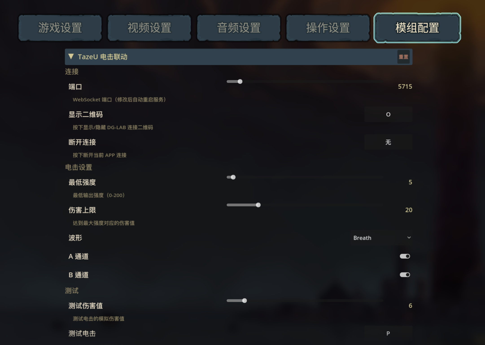
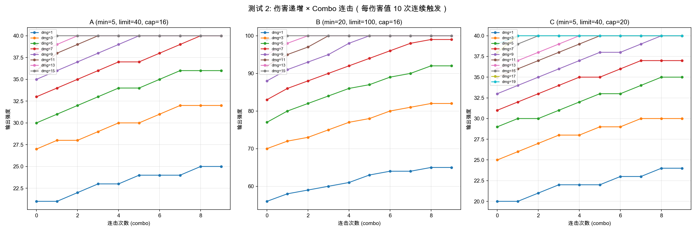
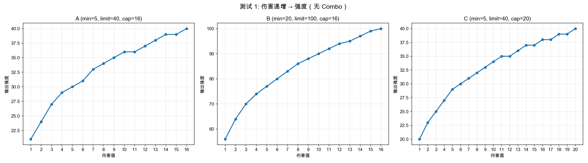

# 🐺 郊狼相生

把鸡煲的电球和郊狼连接，电流相生不再只对敌人有效了！

**⚠️安全警告**

> **使用前必读**：本 Mod 控制物理外设，请注意安全！务必在游玩前通过“测试电击”功能确认设定的强度在您的生理承受范围之内。请务必设置合理的“伤害上限”以防止高额伤害转换为过高电流。若感身体不适请立即切断连接或按下“断开连接”快捷键。本模组作者不对任何因使用本模组造成的身体不适或设备危险负责。

_游玩请适当哦~_

## 特性

- 可视化设置（依赖于 [ModConfig](https://www.nexusmods.com/slaythespire2/mods/27)）
- 可配置电流强度、预设波形，支持自定义波形扩展
- 支持快捷测试电击强度，无需进战调试
- 纯内网直连
- 科学(_可能_)的电流强度算法
- 支持单独开关郊狼通道
- 支持 **Combo** 功能，连续电球的强度会递增（_电流相生爽飞局_）
- 自定义 IP 绑定，可搭配内网穿透组成远程控制
- _多人游戏适配\*_

## 已知问题

这部分的问题若标注了星号，则表示此问题是否是 Bug 存疑，可能不会修复或需要进一步讨论。  
若标注了感叹号，则表示此问题将不会得到修复。  
欢迎 PR 协助开发。

1. \* 多人模式中，所有鸡煲的电球都能触发电击（Hook 未区分玩家）。
2. \* 电流强度算法经过实测，体感似乎较为激进
3. 已支持自定义 IP 绑定 ~~在复杂网络环境中，连接可能会失败（IP 绑定错误），在多网卡设备上更有可能出现。将尽快修复。~~
4. ! 选择的波形若过长，在断开连接后郊狼有可能继续输出短暂时间。问题原因：波形数据在郊狼 App 中是队列缓存的。

# 使用

### 安装

1. 前往 [Releases](https://github.com/star-whisper9/sts2-taseu/releases) 下载最新版本的发行包
2. 解压 Mod 到：
   - Windows: `游戏根目录\mods`
   - macOS: `Steam找到游戏根目录 -> 右键显示包内容 -> Contents -> MacOS -> mods`
3. 前往 [ModConfig](https://www.nexusmods.com/slaythespire2/mods/27) 下载并安装 ModConfig

### 连接与使用

**注意，截至撰稿，模组仅能在游戏版本 `>=0.99` 中使用，与之对应的是 Steam 中的 `public-beta` 测试版。** 如果你有需要在正式版游戏使用，或许可以参见 [BetterSpire2](https://www.nexusmods.com/slaythespire2/mods/2) 在描述中提及的 `替换 Harmony` 的方法。

打开游戏并加载 Mod 后，服务将自动启动。请先前往设置界面配置趁手的快捷键，随后按下快捷键召出连接二维码，使用郊狼 3 版本的 App 通过 Socket 连接，扫描二维码进行连接。**你的电脑和手机必须在同一局域网内，IP 将会自动获取**，若你使用多网卡设备，或希望通过内网穿透进行远程控制，请手动配置正确的监听 IP。

连接成功后，关闭再召出二维码将能看到绿色的已连接状态。**修改连接端口需要手动重新刷新二维码**。

随后你可以使用测试功能逐步调试你舒适的电流强度与波形。**通道的强度上限请在 郊狼 App 中设定！**

## 配置



### 连接设置

- **端口号**：websocket 服务器监听的端口
- **绑定 IP 地址**：默认绑定在 `你可访问互联网的网卡的局域网地址`，留空以使用默认
- **显示二维码**：快捷键 按下后切换连接二维码显示
- **断开连接**：快捷键 按下后立刻断开当前连接

### 电击设置

- **最低强度**：电流强度的下限
- **伤害上限**：电球造成大于此伤害将不再提升电流强度
- **波形**：预设了多种原版郊狼官方波形，参见下表
- **A/B通道**：可单独切换郊狼通道是否启用

| 波形名称 | 内部标识  | 组数 | 是否为了适配短促电击而被精简过 |
| :------- | :-------- | :--- | :----------------------------- |
| 呼吸     | Breath    | 12   | 否                             |
| 潮汐     | Tide      | 10   | 是 (原23组)                    |
| 连击     | Batter    | 12   | 是 (原24组)                    |
| 快速按捏 | Pinch     | 12   | 是 (原46组)                    |
| 按捏渐强 | PinchRamp | 12   | 是 (原23组)                    |
| 心跳节奏 | Heartbeat | 12   | 是 (原36组)                    |
| 压缩     | Squeeze   | 12   | 是 (原21组)                    |
| 节奏步伐 | Rhythm    | 12   | 是 (原27组)                    |

#### 自定义波形

你可以通过添加波形文件来扩展波形列表。将 `.jsonc` 文件放入 Mod 目录下的 `waveforms/` 文件夹（首次启动时自动创建）。文件内容为 JSONC 格式，支持注释。

> 关于 V3 格式波形，请参见郊狼官方文档：  
> [官方波形示例](https://github.com/DG-LAB-OPENSOURCE/DG-LAB-OPENSOURCE/blob/main/socket/DG_WAVES_V2_V3_simple.js)  
> [波形协议文档](https://github.com/DG-LAB-OPENSOURCE/DG-LAB-OPENSOURCE/tree/main/coyote/extra)

**JSONC 格式**

```jsonc
{
  // 在设置中显示的名称
  "name": "我的波形",
  "data": [
    "0A0A0A0A64646464", // 第一帧
    "1E1E1E1E32323232", // 第二帧
  ],
}
```

- `name`：在设置中显示的名称
- `data`：V3 格式波形数据数组，每条为 16 位十六进制字符串（前 8 位 = 4 组频率 10\~240，后 8 位 = 4 组强度 0\~100），每条代表 100ms 内 4×25ms 的输出
- 波形将在 Mod 启动时加载，出现在波形下拉菜单中，修改自定义波形文件后需要重启游戏才能刷新

### 连击递增



- **启用连击递增**：开启后，短时间内连续触发电击时强度逐步递增
- **每层递增比例**：每层 combo 增加的等效伤害百分比（默认 15%）
- **连击窗口**：维持连击的时间窗口，超时未触发则重置（默认 3 秒）
- **最大叠加层数**：连击的上限层数（默认 8 层）

连击乘数作用在伤害输入端而非输出端，借助 Stevens 幂律的压缩特性实现“越叠越缓”的自然递增体感。

#### 调参建议



默认参数偏保守（MinStrength=5, DamageCap=25），适合首次体验。你可以根据自己的通道强度上限（在 App 中设定）进行调整：

- **最低强度**：建议设为 `通道上限 × 5%`（能感觉到但不刺激的起跳值）
- **伤害上限**按风格选择：
  - 温和（适合长时间游玩）：`30`
  - 标准（推荐）：`20~25`
  - 激进（追求刺激）：`12~15`

| 伤害值 | DamageCap=25 时占比 | 典型场景     |
| :----- | :------------------ | :----------- |
| 3      | ~50%                | 无集中被动   |
| 8      | ~71%                | 无集中激发   |
| 6      | ~63%                | 3 层集中被动 |
| 11     | ~78%                | 3 层集中激发 |
| 14     | ~84%                | 6 层集中激发 |

### 测试

- **测试伤害**：伤害数值，将以此伤害作为电球伤害触发测试电击
- **测试电击**：快捷键 按下后以测试伤害触发一次电击

# 开发

## 基础开发

本项目基于 Godot 4.5.1 与 C# (.NET 9.0) 开发。

**开发起步**

1. 克隆本仓库到本地，确保已安装 Godot 4.5.1 与 .NET 9.0 SDK。
2. 将 `<游戏根目录>\sts2.dll` 以及对应的 `0Harmony.dll` 复制或引用到项目中。
3. 任何对 Mod 的底层或 UI 的修改需在 `Scripts/` 完成。
4. 使用 IDE 发布或直接按 `dotnet build` 编译项目。产物将会由于 `<CopyLocalLockFileAssemblies>` 自动包含第三方库，你需要把 `TazeU.dll`、`TazeU.json` 与 `QRCoder.dll` 等所有发布文件拷贝至 `mods/TazeU/`。

**技术要点**

- **WebSocket 绕过权限限制**：Windows 下 `HttpListener` 绑定非 localhost 会被 `http.sys` 拒绝访问（需要管理员权限）。本项目使用原生 `TcpListener` 实现了 HTTP 到 WebSocket（101 协议升级）的握手逻辑，并用 SHA1 计算 `Sec-WebSocket-Key`，手动创建 `WebSocket`。
- **零依赖反向挂载**：使用 C# 反射（Reflection）运行时检测 `ModConfig-STS2`。若未安装该前置，模组也能以默认配置或已保存的 `json` 独立静默运行而不崩溃。
- **动态寻址**：通过注册 `AppDomain.CurrentDomain.AssemblyResolve` 解决了 Godot 导出时不加载第三方 DLL（如 `QRCoder`）的问题。

## 电流与伤害转换算法

为了使玩家体验到的“感知电击强度”与游戏中打出的“伤害数值”线性成正比，本模组引入了 **Stevens 幂律定律（Stevens's power law）的逆映射公式**。因为人体对电刺激的感知强度随物理电流并非线性增长（通常感知强度 $S \propto I^{3.5}$）。

因此，换算算法中作了 $1/3.5$ 的次幂校准：

1. **伤害比例映射**：`ratio = Pow( 当前伤害 / 设定的伤害上限, 1.0 / 3.5 )`。
2. **限幅与强度映射**：首先将计算出的指数比例 Clamp（夹逼）在 `0.0 ~ 1.0` 之间，随后推导出下发给郊狼的具体物理强度参数 `发送强度值 = MinStrength + Round((通道可承受最高上限 - MinStrength) * ratio)`。
3. **连击递增**：启用 Combo 模式时，乘数作用在伤害输入端 `effective_damage = damage × (1 + combo × rate)`，经由幂律压缩后输出自然趋近上限而不会骤然封顶。
4. 若最高上限已低于基础起跳强度，或网络断开异常，代码会予以保护直接回落极值或丢弃指令。

## TODO

- [x] 支持更多波形（包括自定义波形）
- [ ] 支持一对多连接（1 人游玩，N 人被电）
- [ ] 添加模式切换功能，考虑使用更温柔的算法实现“舒适模式”
- [x] 实现强度递增（随连续激发的电球数量，_电流相生爽飞局_）

# License

通过 Apache License 2.0 许可协议授权。详情请参见 [LICENSE](LICENSE) 文件。

欢迎 PR 与二开！如果你有任何问题或建议，也欢迎在 Issues 中提出（_还请提出有意义的 Issue_）。
